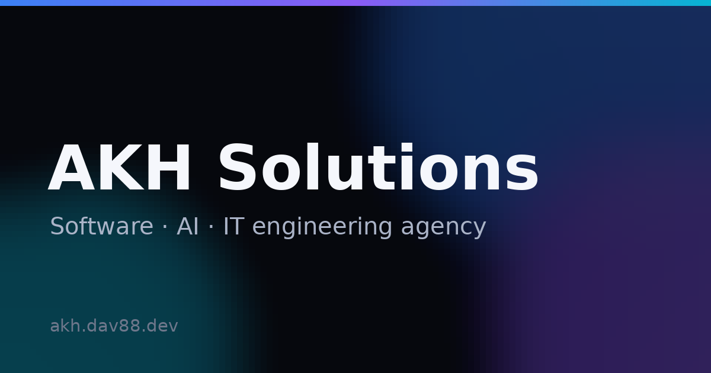
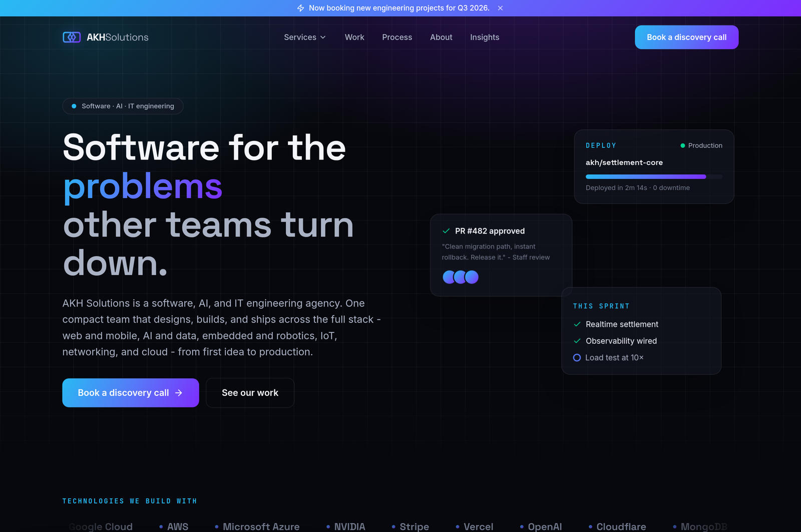
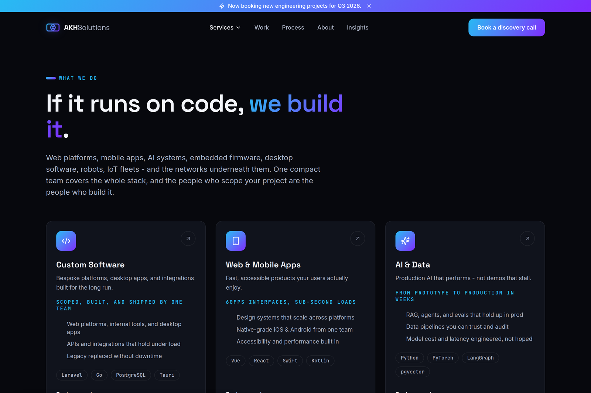
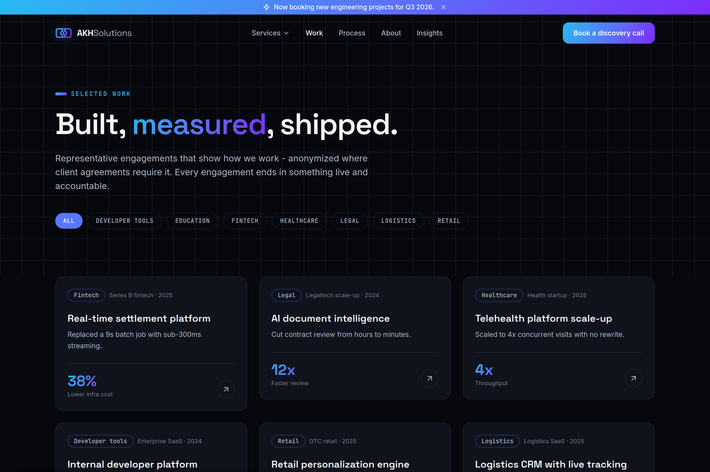
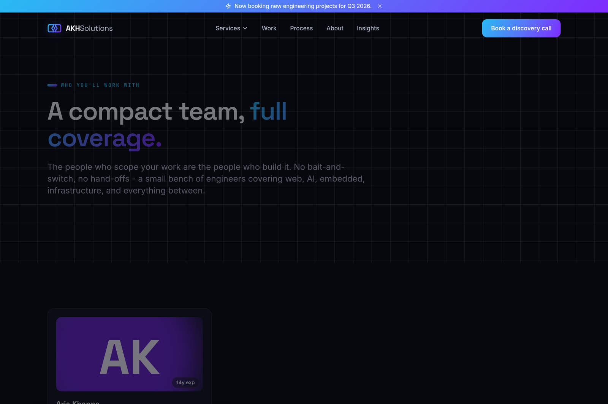
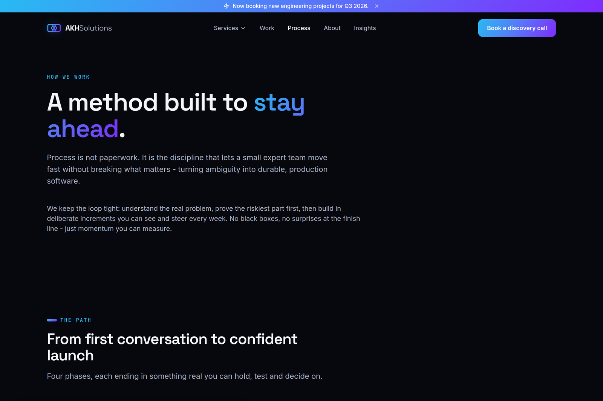

<p align="center">
  
</p>

<h1 align="center">AKH Solutions</h1>

<p align="center">
  <strong>Software · AI · IT engineering agency</strong> — a marketing site with a custom, fully editable CMS.<br>
  Built across the full stack: web, mobile, AI &amp; data, embedded &amp; robotics, IoT, networking, and cloud.
</p>

<p align="center">
  <a href="https://github.com/Art-ha666/web/actions/workflows/ci.yml"></a>
  
  
  
  
  
</p>

---

<p align="center">
  
</p>

## ✨ What it is

A production-ready agency website where **every word, section, and page is editable from an admin panel** — no redeploy needed. It ships with a schema-driven CMS, a switchable multi-design theme engine, an AI blog writer, and full server-rendered SEO.

## 🚀 Features

- **Fully editable CMS** — per-page content schemas merge over database overrides, so a generic admin editor covers every page (hero, services, work, process, about, team, insights, careers, contact) with no bespoke forms.
- **Nested pages** — build arbitrary page trees (`/page/parent/child`) with breadcrumbs, canonical redirects, and reserved-slug protection. A real CMS, not just static routes.
- **15 switchable designs** — one click in the admin swaps the entire look; 8 of them are interactive Three.js / WebGL heroes. Colours are admin-overridable via CSS custom properties.
- **AI blog writer** — generates draft or auto-published articles via OpenAI, Gemini, or an offline template fallback; providers and keys are managed in the admin.
- **Server-rendered SEO** — per-page meta + Open Graph / Twitter cards, `BlogPosting` &amp; `BreadcrumbList` JSON-LD, a branded OG image, an auto-generated `sitemap.xml`, and `robots.txt`.
- **Privacy & consent** — cookie-consent banner that gates analytics, plus hardened legal pages (privacy, cookies, terms).
- **Hardened** — request throttling, honeypot-protected forms, trusted-proxy config, and dash-normalised input.

## 🖼️ Screenshots

| Services | Work |
| --- | --- |
|  |  |
| **Team** | **Process** |
|  |  |

## 🧱 Tech stack

| Layer | Tech |
| --- | --- |
| Backend | Laravel 13, PHP 8.4+ |
| Frontend | Inertia v3, Vue 3.5, Tailwind CSS 4 |
| Auth | Laravel Fortify |
| 3D / WebGL | Three.js |
| Testing | Pest 4 (134 tests) |
| Tooling | Laravel Sail (Docker), Vite, Wayfinder, Pint, ESLint |
| Data | MySQL, Redis |

## 🏁 Getting started

Requires Docker. Everything runs through [Laravel Sail](https://laravel.com/docs/sail) — no local PHP/Node needed.

```bash
# 1. Clone and configure
git clone git@github.com:Art-ha666/web.git akh-solutions
cd akh-solutions
cp .env.example .env

# 2. Install PHP deps with a throwaway container
docker run --rm -v "$(pwd)":/opt -w /opt laravelsail/php84-composer:latest \
  composer install --ignore-platform-reqs

# 3. Boot the stack
./vendor/bin/sail up -d
./vendor/bin/sail artisan key:generate
./vendor/bin/sail artisan migrate --seed

# 4. Build the frontend
./vendor/bin/sail npm install
./vendor/bin/sail npm run dev      # or: sail npm run build
```

Then open **http://localhost** (set `APP_PORT` in `.env` to change the port).

### Admin

The CMS lives at **`/admin`**. The seeder creates a default account:

```
email:    admin@akhsolutions.com
password: password
```

> Change these before going to production, and set your real `OPENAI_API_KEY` / `GEMINI_API_KEY` in `.env` to enable the AI writer.

## 🧪 Testing

```bash
./vendor/bin/sail artisan test            # full suite
./vendor/bin/sail artisan test --compact  # condensed output
./vendor/bin/sail bin pint                # format PHP
./vendor/bin/sail npm run lint            # lint JS/Vue
```

CI runs the suite, Pint, and a Vite build on **PHP 8.4 and 8.5** on every push.

## 📦 Deployment

A production `Dockerfile` (nginx + php-fpm + supervisor) and a GitHub Actions workflow for **AWS ECS Fargate** are included under `docker/production/` and `.github/workflows/deploy.yml`. The deploy job stays dormant until you set the repo variable `ENABLE_AWS_DEPLOY=true` and wire up the AWS OIDC role + secrets documented at the top of that workflow.

## 📄 License

Private and proprietary. © 2026 AKH Solutions. Not licensed for redistribution.
